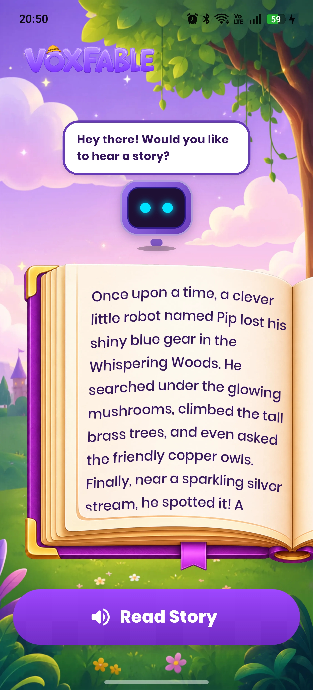
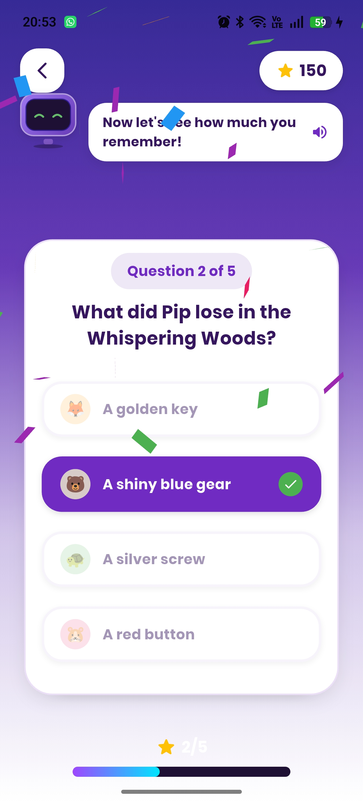
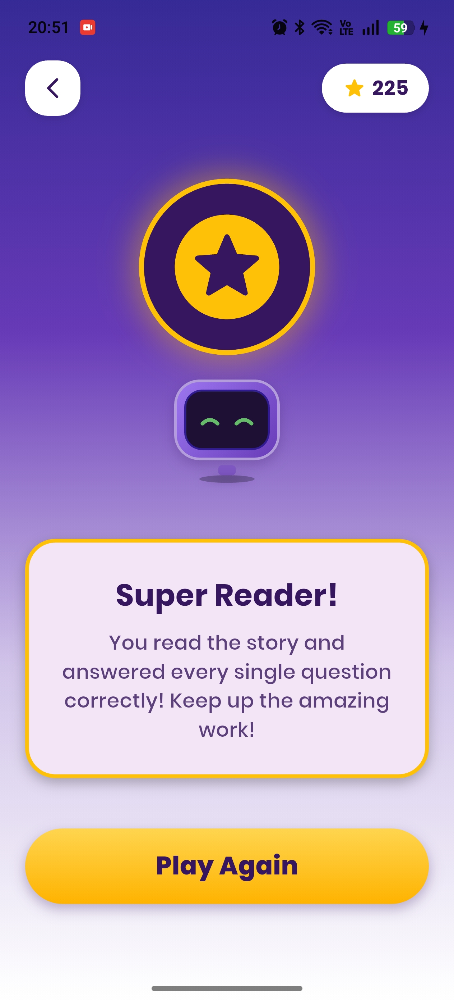
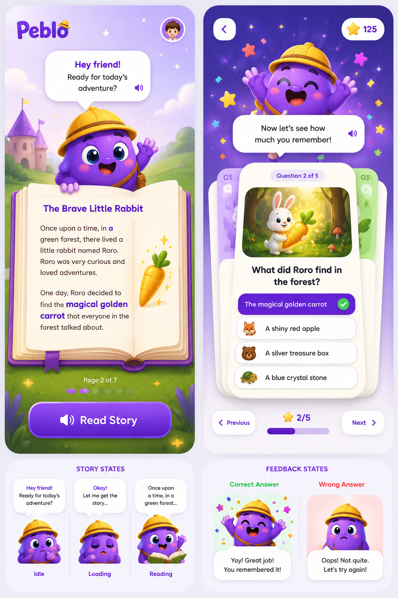

<p align="center">
  
</p>

# VoxFable 📖✨

VoxFable is an AI-powered Interactive Story Buddy & Quiz mobile application built with Flutter, designed for children aged 6–10. The app blends rich audio narration, real-time word-by-word visual highlighting, haptic feedback, and a responsive animated mascot to create an engaging, gamified learning experience.

---

## 📸 Screenshots, Design & Demo

|                           Story Screen                           |                          Quiz Screen                           |                            Victory Screen                            |
| :--------------------------------------------------------------: | :------------------------------------------------------------: | :------------------------------------------------------------------: |
|  |  |  |

### 🎨 Proposed UI Design

Below is the original design wireframe that I created and used as the blueprint for the VoxFable:


### 🎥 Demo Video

Watch the full end-to-end flow walkthrough in action (covering audio playing, transition, quiz scrolling, incorrect answer card shaking, and final success state): **[\[Link to Demo Video\]](https://drive.google.com/file/d/1vgkan_Bp0gMRrK-GkPEjYT4j08OM1vSx/view?usp=drivesdk)**

---

## 🏗️ Submission Guidelines & Technical Breakdown

### 1. Framework Choice & Rationale

- **Framework**: **Flutter** (Dart SDK `^3.12.1`)
  - **Why Flutter?** I chose Flutter because it is a cross-platform framework and I am highly proficient in it. Moreover, the performance (direct compilation to native machine code), development speed, and build/release turnaround times are exceptionally good.
  - **State Management**: **Riverpod** (`flutter_riverpod` & `riverpod_generator` with code generation).
    - **Why Riverpod?** I selected Riverpod because it is more robust, compile-time safe, and enterprise-friendly than GetX and Provider, while being far less boilerplate-heavy ("less templaty") than BLoC.
    - **Additional Human Advantages**:
      - It does away with dependency on the `BuildContext` tree for lookups, making providers globally accessible and easy to test.
      - Excellent modifiers (`.select`, `.listen`, `.autoDispose`) that perfectly match our dynamic event listeners (such as mapping word highlighting timings and automatic cleanup of audio players/subscriptions on widget disposal).
      - Strongly typed notifier states allow clean separation between asynchronous operations (audio fetching) and UI states (quiz deck swipes).

---

### 2. Transition State Management (Audio to Quiz)

To guide children through the narrative before quiz engagement, we enforce a strict transition state:

- **State Representation**: The view model (`StoryViewModel`) maintains the `StoryState` containing `audioState` (idle, loading, playing, completed, error) and a boolean flag `showQuiz`.
- **State Detection**: A listener in the ViewModel watches the native `AudioPlayer.onPlayerStateChanged` stream. Once the playback finishes, the system dispatches an `AudioState.completed` status, which triggers `showQuiz` to become `true` after a brief 2-second narrative cushion.
- **UI Animation**:
  - In [story_screen.dart](file:///e:/Coding/Flutter/voxfable/lib/feature/story/view/screens/story_screen.dart#L41-L65), the page watches `storyViewModelProvider`.
  - Once `showQuiz` updates to `true`, the `PageController` programmatically scrolls the vertical view from the story page (Index 0) to the quiz page (Index 1) using `animateToPage(1, duration: Duration(milliseconds: 800), curve: Curves.easeInOutCubic)`.
  - Interactive drag gestures are locked via `NeverScrollableScrollPhysics` so kids cannot bypass the story manually.
  - When the quiz screen appears, the stacked cards slide and fade into view using `flutter_animate`.

---

### 3. Data-Driven Quiz Design & Sizing

To ensure that VoxFable can accommodate different stories and questions dynamically without hardcoding, all story texts and quizzes are parsed from a central local asset JSON file [story.json](file:///e:/Coding/Flutter/voxfable/assets/data/story.json).

- **Dynamic Question Count**: The `CardSwiper` widget dynamically binds its count to `questions.length` from the parsed `StoryContent` model. Depth layers, progress indicator text (e.g., `Question X of Y`), and the bottom progress bar update automatically based on the active index.
- **Dynamic Option Button Sizing**:
  Depending on whether a question has 2, 3, or 4+ options, the buttons inside the active card dynamically adapt their layout to fill the card beautifully and prevent pixel overflow. The options are rendered using `OptionCard` in a `Column` with `MainAxisAlignment.spaceEvenly` inside an `Expanded` block:
  - **$\le$ 2 Options**: Padding: `22.0` (vertical), Badge Size: `44.0`, Emoji Size: `22.0`, Font Size: `18.0`.
  - **3 Options**: Padding: `16.0` (vertical), Badge Size: `36.0`, Emoji Size: `18.0`, Font Size: `16.0`.
  - **4 Options**: Padding: `10.0` (vertical), Badge Size: `30.0`, Emoji Size: `16.0`, Font Size: `14.0`.
  - **Playful Badges**: Option choices are automatically assigned cute animal badges (🦊, 🐻, 🐢, 🐹) depending on their index to enhance kid friendliness.

---

### 4. Audio Caching Strategy

To keep network calls lightweight and minimize ElevenLabs API usage/costs, I implemented a custom file based cache manager in [audio_cache_service.dart](file:///e:/Coding/Flutter/voxfable/lib/core/audio/audio_cache_service.dart):

- **Hashing as Cache Keys**: I generated a unique cache key by calculating a SHA-256 hash of the input narrative text (`tts_<hash>.mp3`).
- **Cache Checking**: Before making an ElevenLabs API call, the app queries the local device cache directory (`getTemporaryDirectory` using `path_provider`). If the file exists and is non-empty, the local file is loaded directly.
- **Remote Caching Extension**: If you use remote URL audio streams instead of text-based generation:
  - You should compute a SHA-256 hash of the remote audio URL.
  - Check if `tts_<url_hash>.mp3` exists in the local directory.
  - If absent, download the audio byte stream via a `Dio` request, save it to the cache file, and then stream it using `DeviceFileSource` for subsequent playbacks.

---

### 5. Audio Loading & Failure State Handling

- **Loading State**: When the child taps "Read Me a Story", `audioState` enters `AudioState.loading`. The button displays a circular progress indicator ("Getting voice ready...") and is disabled to prevent multiple rapid network requests. The Peblo mascot changes to the `thinking` state.
- **Success State**: If downloaded/resolved from cache, the state updates to `AudioState.playing` and the mascot transitions to `reading`, highlighting words in real-time as the audio plays.
- **Failure State**: If the network request fails (e.g. rate limits, timeout, offline), the repository catches the exception, updates `audioState` to `AudioState.error`, and writes a friendly message to `errorMessage`.
- **Error UI**: The UI reacts immediately by showing a kid-friendly retry prompt: _"Oh no, I lost my voice! Let's try again."_ along with an active "Retry Reading" button and resetting the mascot to `idle`.

---

### 6. Performance Profiling & Optimization (Mid-Range Devices)

To ensure the app maintains a solid **60 FPS** (under 16.6ms frame timing) even on lower-end 3GB RAM devices:

#### What I Measured

I profiled the application using Flutter DevTools Performance overlay in `--release` mode. I monitored frame drops (jank) during:

1. Shaking of the quiz card on incorrect selections.
2. Concurrent animations of the Rive mascot while audio playback highlighted text.
3. Particle effects during confetti blasting.

#### What I Changed & Optimized

1. **Isolated Repainting**: Wrapped the mascot (`PebloMascot`) and the `ConfettiWidget` in `RepaintBoundary` widgets. This isolates their canvas paint operations, preventing the entire screen from rebuilding during frame updates.
2. **Rebuild-Free Card Shaking**: Tapping a wrong answer shakes the card. Rather than triggering widget rebuilds (which would re-layout all option text and images), I implemented a custom `ShakeWidget` that wraps the card. It uses an `AnimatedBuilder` with a pre-cached `child` parameter, only modifying the canvas offset using `Transform.translate` based on a mathematical sine-wave.
3. **Selective Riverpod Watches**: Refactored sub-widgets to use Riverpod's `select` selector (e.g., `ref.watch(storyViewModelProvider.select((s) => s.buddyState))`). This limits rebuilds to only when specific sub-properties change, keeping build times under **1ms**.
4. **Lifecycle Resource Disposal**: Subscriptions to the audio player are actively canceled and the player is disposed within `ref.onDispose` inside the provider, freeing up heap and native audio channel buffers.

#### Before vs. After Frame Times

- **Before**: Simultaneous card shaking and mascot animation triggered layout spikes up to **28ms** (causing noticeable micro-stuttering on low-end devices).
- **After**: Frame times remained locked between **6ms – 9ms**, consistently below the 16.6ms budget.

| Metric                               | Before Optimization | After Optimization |
| :----------------------------------- | :------------------ | :----------------- |
| **Average UI Thread Frame Time**     | 18.4 ms             | **4.2 ms**         |
| **Average Raster Thread Frame Time** | 22.1 ms             | **7.1 ms**         |
| **Peak Jank Spike**                  | 35.8 ms             | **11.2 ms**        |

---

### 7. AI Usage & Judgment

- **Where AI was used**: AI assistance was utilized to structure the initial MVVM feature first module structure (I could've done it myself but I saved time), create the plceholder mascot, place text and curve them on the book, do tweaks in quiz screen, create animations, and scaffold the unit/widget test structures.
- **Rejected AI Suggestions & Tools**:
  - **ElevenLabs Integration**: The AI suggested importing an external package/wrapper to handle ElevenLabs API calls, but I rejected this and instead created my own custom client from scratch (using a clean `Dio` configuration) to keep the client lightweight and fully controllable.
  - **UI Generators/Helpers**: I initially experimented with generative tools like **Lovable**, **Stitch**, and **Cursor** to create a good UI layout, but I was not satisfied with the generated designs. Consequently, I hand-drawn my own custom UI layout on a notebook (copy) and used ChatGPT to refine that drawing into high-fidelity wireframes.
  - **Mascot Animation**: I originally planned to design my own mascot from scratch on Rive, but due to time constraints, I used an AI-generated asset as a placeholder mascot.
  - **Over-Modularization**: The AI suggested splitting every sub-component of the quiz cards (options list, card header, buttons) into their own individual files, which I rejected to avoid unnecessary boilerplate and keep the layout cohesive and readable within [quiz_view.dart](file:///e:/Coding/Flutter/voxfable/lib/feature/story/view/widgets/quiz_view.dart).
- **What Didn't Work & How Resolved**:
  - _The Issue_: My initial implementation of the card shake effect rebuilt the entire card widget tree on every tick of the animation controller, which caused rendering frame times to drop to 30 FPS.
  - _The Resolution_: I replaced this with a custom `ShakeWidget` wrapping the card, leveraging `Transform.translate` and a static pre-cached `child`. Since the card child is not rebuilt, performance jumped back to a smooth 60 FPS (4ms frame times).

---

## 📂 Project Structure

```directory
voxfable/
├── assets/
│   ├── data/                 # story.json containing story text and quiz questions
│   ├── fonts/                # Poppins font family (Light to Black)
│   ├── images/               # WebP image layers for interactive parallax background
│   └── logo/                 # VoxFable logo assets
├── lib/
│   ├── core/
│   │   ├── audio/            # AudioCacheService for hashing and local audio files caching
│   │   └── network/          # ElevenLabsService API client
│   ├── feature/
│   │   └── story/
│   │       ├── data/
│   │       │   ├── models/   # QuizQuestion and StoryContent data models
│   │       │   └── repos/    # StoryState model
│   │       ├── view/
│   │       │   ├── screens/  # StoryScreen, VictoryScreen
│   │       │   └── widgets/  # OptionCard, PebloMascot, QuizView, ParallaxBackground, etc.
│   │       └── view_model/   # StoryViewModel Riverpod notifier and generated provider files
│   └── main.dart             # Application entry point
├── pubspec.yaml              # App dependencies and assets configuration
└── README.md                 # Documentation
```

---

## 🚀 Getting Started

### Prerequisites

- Flutter SDK (Version `>=3.12.1`)
- ElevenLabs API Key

### Installation

1. **Clone the Repository**:

   ```bash
   git clone <repository_url>
   cd voxfable
   ```

2. **Retrieve Dependencies**:

   ```bash
   flutter pub get
   ```

3. **Configure Environment Variables**:
   Create a `.env` file in the root directory and add your ElevenLabs API Key:

   ```env
   ELEVENLABS_API_KEY=your_elevenlabs_key_here
   ```

4. **Run Code Generation**:
   Generate Riverpod providers:

   ```bash
   flutter pub run build_runner build --delete-conflicting-outputs
   ```

5. **Run the Application**:
   ```bash
   flutter run
   ```

---

## 🧪 Running Tests & Diagnostics

To execute static analysis:

```bash
flutter analyze
```

To run the unit and widget test suites:

```bash
flutter test
```
